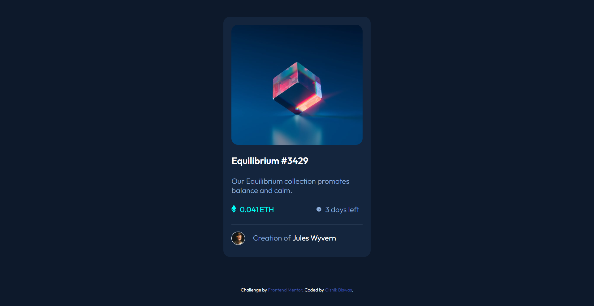

# Frontend Mentor - NFT preview card component solution

This is a solution to the [NFT preview card component challenge on Frontend Mentor](https://www.frontendmentor.io/challenges/nft-preview-card-component-SbdUL_w0U). Frontend Mentor challenges help you improve your coding skills by building realistic projects. 

## Table of contents

- [Overview](#overview)
  - [The challenge](#the-challenge)
  - [Screenshot](#screenshot)
  - [Links](#links)
- [My process](#my-process)
  - [Built with](#built-with)
  - [What I learned](#what-i-learned)
  - [Continued development](#continued-development)
  - [Useful resources](#useful-resources)
- [Author](#author)
- [Acknowledgments](#acknowledgments)


## Overview

### The challenge

Users should be able to:

- View the optimal layout depending on their device's screen size
- See hover states for interactive elements

### Screenshot




### Links

- Solution URL: [github](https://github.com/pippal5536/frontend-mentor-nft-preview-card-component-main)
- Live Site URL: [netlify](https://relaxed-dasik-6ef87f.netlify.app/)

## My process

### Built with

- Semantic HTML5 markup
- Flexbox
- CSS Grid
- Mobile-first workflow


### What I learned

```
/*I learnt how to center an element.Thanks to Fireship.[FireShip](https://www.youtube.com/shorts/njdJeu95p6s)*/
/*Classic Approach:*/
.parent{
  position: relative;
}
.child{
  position: absolute;
  top:50%;
  left:50%;
  transform: translate(-50%,-50%);
}
/*Modern Approach*/
.parent{
  display: grid;
  place-items: center;
}
/* I knew hsl. But I learnt about hsla by doing is project. */
```

### Continued development

I need to practice height and width

### Useful resources

- [CodeAgam](https://www.youtube.com/watch?v=88aBN3N45WA) - I was struggling with the hover image. This video helped me to solve it. 
- [FireShip](https://www.youtube.com/shorts/njdJeu95p6s) - This video helped me to center the eye icon


## Author

- Frontend Mentor - [pippal5536](https://www.frontendmentor.io/profile/pippal5536)

## Acknowledgments

Thanks to CodeAgam and Fireship.

